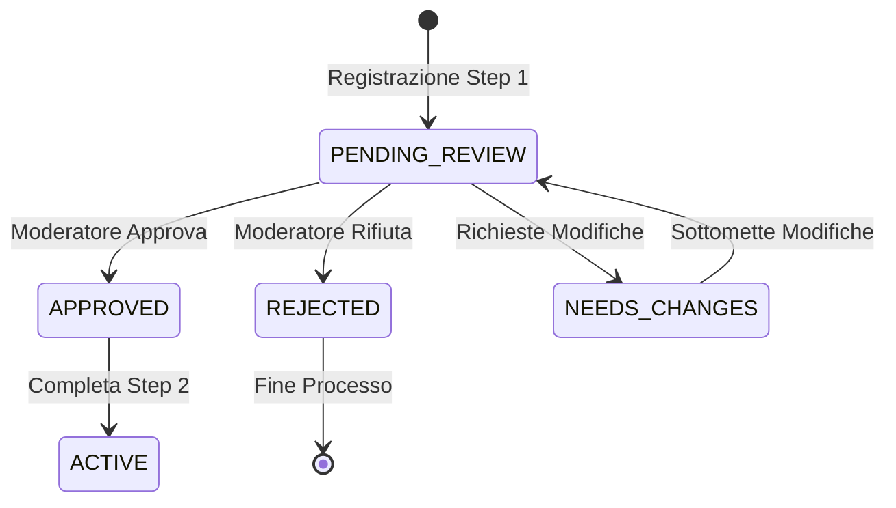

# Stati della Registrazione Medici

## Overview

Il processo di registrazione dei medici passa attraverso diversi stati che riflettono il flusso di moderazione e completamento.

## Diagramma Stati



## Dettaglio Stati

### 1. PENDING_REVIEW
- **Trigger**: Completamento Step 1 (Nome + Certificazione)
- **Permessi**: 
  - Può solo visualizzare stato
  - Non può accedere al sistema
- **Azioni Disponibili**:
  - Moderatore può approvare/rifiutare/richiedere modifiche
  - Medico può solo attendere

### 2. APPROVED
- **Trigger**: Moderatore approva documenti
- **Permessi**:
  - Può accedere al link email
  - Può completare Step 2
- **Azioni Disponibili**:
  - Completare registrazione
  - Visualizzare dati inseriti

### 3. REJECTED
- **Trigger**: Moderatore rifiuta documenti
- **Permessi**:
  - Nessun accesso al sistema
  - Può solo rifare registrazione
- **Azioni Disponibili**:
  - Iniziare nuova registrazione
  - Visualizzare motivo rifiuto

### 4. NEEDS_CHANGES
- **Trigger**: Moderatore richiede modifiche
- **Permessi**:
  - Può modificare submission
  - Non può accedere al sistema
- **Azioni Disponibili**:
  - Modificare dati esistenti
  - Ricaricare documenti
  - Sottomettere modifiche

### 5. ACTIVE
- **Trigger**: Completamento Step 2
- **Permessi**:
  - Accesso completo al sistema
  - Tutte le funzionalità attive
- **Azioni Disponibili**:
  - Usare il sistema
  - Modificare profilo
  - Gestire disponibilità

## Transizioni di Stato

### Da PENDING_REVIEW
- → APPROVED
  - Moderatore verifica documenti
  - Documenti validi e corretti
  - Genera token registrazione
  - Invia email conferma

- → REJECTED
  - Documenti non validi
  - Dati non corrispondenti
  - Invia email con motivo
  - Registrazione chiusa

- → NEEDS_CHANGES
  - Documenti incompleti
  - Dati da correggere
  - Invia email con richieste
  - Mantiene dati esistenti

### Da APPROVED
- → ACTIVE
  - Click su link email
  - Token valido
  - Completa Step 2
  - Setup account

### Da NEEDS_CHANGES
- → PENDING_REVIEW
  - Modifiche sottomesse
  - Nuova revisione
  - Notifica moderatore

## Validazioni per Stato

### PENDING_REVIEW
```php
[
    'full_name' => 'required|string|max:255',
    'certification' => 'required|file|mimes:pdf|max:5120',
]
```

### APPROVED
```php
[
    'token' => 'required|exists:doctors,registration_token|not_expired',
]
```

### ACTIVE
```php
[
    'email' => 'required|email|unique:doctors',
    'phone' => 'required|string',
    'address' => 'required|string',
    'availability' => 'required|array',
]
```

## Note Implementative

### Middleware di Stato
```php
class CheckDoctorState
{
    public function handle($request, $next)
    {
        $doctor = $request->user()->doctor;
        
        if ($doctor->status !== DoctorStatus::ACTIVE) {
            return redirect()->route('doctor.status');
        }

        return $next($request);
    }
}
```

### Policy di Accesso
```php
class DoctorPolicy
{
    public function completeRegistration(User $user, Doctor $doctor)
    {
        return $doctor->status === DoctorStatus::APPROVED 
            && $doctor->token_expires_at->isFuture();
    }
}
```

## Collegamenti
- [Registration Workflow](doctor-registration-workflow.md)
- [Form Implementation](form-implementation-errors.md)
- [Email Templates](../../Xot/docs/email-templates.md)

## Vedi Anche
- [Laravel State Machine](https://laravel.com/docs/master/structure#the-app-directory)
- [Filament Forms](https://filamentphp.com/docs/forms) 