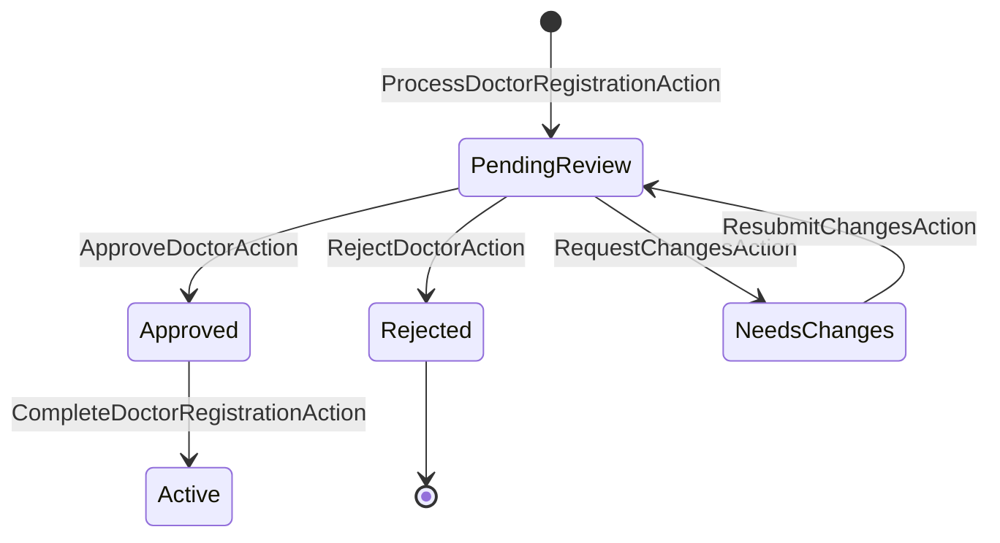

# Workflow di Registrazione Medici

## Overview

Il processo di registrazione medici utilizza una combinazione di Model States e Queueable Actions per gestire il flusso di approvazione.

## Stati e Transizioni



## Processo di Registrazione

### Step 1: Registrazione Iniziale
```php
// Controller
public function register(RegistrationRequest $request)
{
    $doctor = app(ProcessDoctorRegistrationAction::class)
        ->onQueue()
        ->execute(
            $request->validated(),
            $request->file('certification')
        );

    return response()->json([
        'message' => 'Registrazione inviata con successo',
        'doctor' => $doctor
    ]);
}

// Action
class ProcessDoctorRegistrationAction
{
    use QueueableAction;

    public function execute(array $data, UploadedFile $certification): Doctor
    {
        return DB::transaction(function () use ($data, $certification) {
            $doctor = Doctor::create([
                'full_name' => $data['full_name'],
                'state' => PendingReviewState::class
            ]);

            $doctor->addMedia($certification)
                ->toMediaCollection('certifications');

            event(new DoctorRegistrationSubmitted($doctor));

            return $doctor;
        });
    }
}
```

### Step 2: Moderazione
```php
// Filament Resource
class DoctorResource extends Resource
{
    public function table(Table $table): Table
    {
        return $table
            ->columns([
                TextColumn::make('full_name'),
                TextColumn::make('state')
                    ->badge()
                    ->color(fn (Doctor $record): string => 
                        $record->state->color()
                    ),
            ])
            ->actions([
                Action::make('approve')
                    ->visible(fn (Doctor $record): bool => 
                        $record->state instanceof PendingReviewState
                    )
                    ->action(fn (Doctor $record) => 
                        app(ApproveDoctorAction::class)
                            ->onQueue()
                            ->execute($record)
                    ),
                
                Action::make('reject')
                    ->visible(fn (Doctor $record): bool => 
                        $record->state instanceof PendingReviewState
                    )
                    ->form([
                        TextArea::make('reason')
                            ->required()
                    ])
                    ->action(fn (Doctor $record, array $data) => 
                        app(RejectDoctorAction::class)
                            ->onQueue()
                            ->execute($record, $data['reason'])
                    ),
            ]);
    }
}
```

### Step 3: Notifiche Email
```php
class DoctorStateChanged extends Event
{
    public function __construct(
        public Doctor $doctor,
        public DoctorState $fromState,
        public DoctorState $toState
    ) {}
}

class SendDoctorStateNotification
{
    public function handle(DoctorStateChanged $event)
    {
        match (get_class($event->toState)) {
            ApprovedState::class => 
                Mail::to($event->doctor)->send(new DoctorApprovedMail($event->doctor)),
            RejectedState::class => 
                Mail::to($event->doctor)->send(new DoctorRejectedMail($event->doctor)),
            NeedsChangesState::class => 
                Mail::to($event->doctor)->send(new DoctorNeedsChangesMail($event->doctor)),
            default => null
        };
    }
}
```

### Step 4: Completamento Registrazione
```php
class CompleteDoctorRegistrationAction
{
    use QueueableAction;

    public function execute(Doctor $doctor, array $data): void
    {
        if (!$doctor->state instanceof ApprovedState) {
            throw new InvalidStateTransition(
                "Cannot complete registration from state: {$doctor->state::class}"
            );
        }

        DB::transaction(function () use ($doctor, $data) {
            $doctor->state->transitionTo(ActiveState::class);
            
            $doctor->update([
                'email' => $data['email'],
                'phone' => $data['phone'],
                'address' => $data['address'],
                'availability' => $data['availability'],
            ]);

            event(new DoctorRegistrationCompleted($doctor));
        });
    }

    public function backoff(): array
    {
        return [1, 5, 10];
    }
}
```

## Middleware e Protezione Route

```php
class EnsureDoctorCanAccessDashboard
{
    public function handle($request, $next)
    {
        $doctor = $request->user()->doctor;

        if (!$doctor->state instanceof ActiveState) {
            if ($doctor->state instanceof ApprovedState) {
                return redirect()->route('doctor.complete-registration');
            }

            return redirect()->route('doctor.registration-status');
        }

        return $next($request);
    }
}

// routes/web.php
Route::middleware(['auth', 'doctor.active'])
    ->prefix('doctor')
    ->group(function () {
        Route::get('/dashboard', DoctorDashboard::class);
        Route::get('/appointments', AppointmentList::class);
    });
```

## Testing

```php
class DoctorRegistrationTest extends TestCase
{
    /** @test */
    public function it_follows_complete_registration_flow()
    {
        Queue::fake();
        Event::fake();

        // Step 1: Registrazione
        $doctor = app(ProcessDoctorRegistrationAction::class)
            ->execute($this->validData(), $this->validCertification());

        $this->assertInstanceOf(PendingReviewState::class, $doctor->state);
        Event::assertDispatched(DoctorRegistrationSubmitted::class);

        // Step 2: Approvazione
        app(ApproveDoctorAction::class)->execute($doctor);
        
        $doctor->refresh();
        $this->assertInstanceOf(ApprovedState::class, $doctor->state);
        Event::assertDispatched(DoctorStateChanged::class);

        // Step 3: Completamento
        app(CompleteDoctorRegistrationAction::class)
            ->execute($doctor, $this->completionData());

        $doctor->refresh();
        $this->assertInstanceOf(ActiveState::class, $doctor->state);
        Event::assertDispatched(DoctorRegistrationCompleted::class);
    }
}
```

## Note Importanti

1. **Transazioni**
   - Ogni transizione di stato è in una transazione
   - Gli eventi sono dispatchati dopo il commit
   - Rollback automatico in caso di errori

2. **Code e Performance**
   - Actions pesanti in coda dedicata
   - Retry configurati per resilienza
   - Monitoring con Horizon

3. **Sicurezza**
   - Validazione stato prima delle transizioni
   - Middleware per protezione route
   - Logging di tutte le transizioni

## Collegamenti
- [State Management](doctor-state-management.md)
- [Queueable Actions Guide](queueable-actions-guide.md)
- [Email Templates](doctor-email-templates.md)

## Vedi Anche
- [Spatie Model States](https://spatie.be/docs/laravel-model-states)
- [Spatie Queueable Action](https://github.com/spatie/laravel-queueable-action)
- [Laravel Events](https://laravel.com/docs/events)

## Errori Comuni e Soluzioni

1. **Controllo esistenza dottore**
   - ❌ User::where('email', ...)
   - ✅ Doctor::where('email', ...)

2. **Gestione status con fallback**
   - Usare metodo privato per ottenere lo status:
   ```php
   private function getDoctorRegistrationStatus(): string {
       if (!class_exists(DoctorRegistrationStatus::class)) return 'pending';
       try {
           foreach (DoctorRegistrationStatus::cases() as $case) {
               if (strtolower($case->name) === 'pending') return $case->value;
           }
           return 'pending';
       } catch (\Exception $e) { return 'pending'; }
   }
   ```

3. **Gestione ValidationException custom**
   - ✅ throw ValidationException::withMessages(['email' => ['Messaggio personalizzato']]);

## Checklist
- [ ] Controllo su Doctor
- [ ] Gestione status robusta
- [ ] Error handling idiomatico
- [ ] Collegamenti bidirezionali
- [ ] Test e validazione

## Collegamenti
- [Regole Namespace Xot](../../Xot/docs/NAMESPACE_RULES.md)
- [Error Handling Xot](../../Xot/docs/error-handling.md)
- [README Xot](../../Xot/docs/README.md) 
