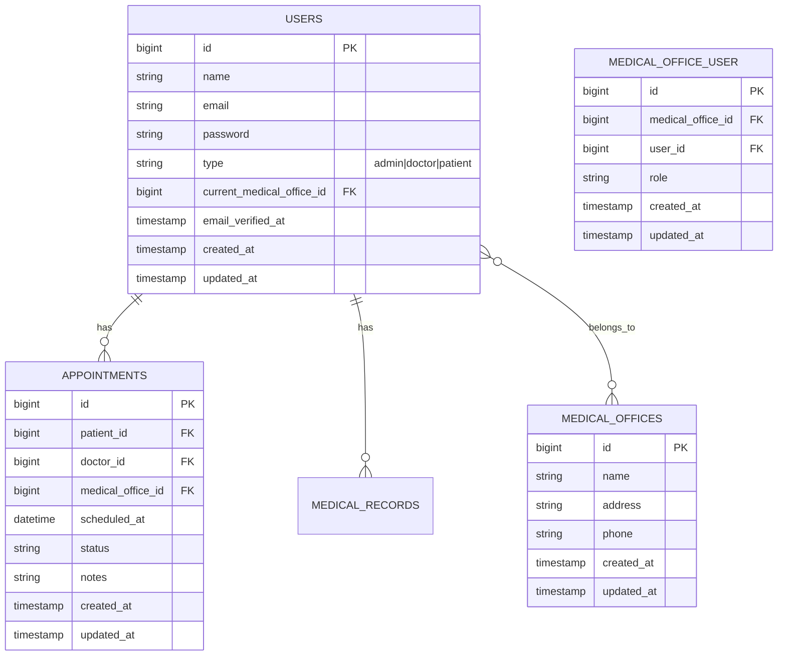

# Guida alla Configurazione Multi-tenancy in Filament per SaluteOra

## Indice

1. [Introduzione](#introduzione)
2. [Architettura del Sistema](#architettura-del-sistema)
3. [Configurazione dei Modelli](#configurazione-dei-modelli)
4. [Middleware e Autenticazione](#middleware-e-autenticazione)
5. [Policy e Autorizzazioni](#policy-e-autorizzazioni)
6. [Filament Resources](#filament-resources)
7. [Widget e Dashboard](#widget-e-dashboard)
8. [Testing](#testing)
9. [Troubleshooting](#troubleshooting)
10. [Miglioramenti Futuri](#miglioramenti-futuri)

## Introduzione

Questo documento fornisce una guida dettagliata per l'implementazione del multi-tenancy in Filament all'interno dell'ecosistema SaluteOra. Il sistema è progettato per gestire tre tipi principali di utenti:

- **Amministratori**: Accesso completo al sistema
- **Dottori**: Accesso limitato ai propri studi medici e pazienti
- **Pazienti**: Accesso limitato ai propri dati e appuntamenti

L'architettura utilizza il pattern Single Table Inheritance (STI) tramite il pacchetto Parental per la gestione dei tipi di utente, garantendo flessibilità e manutenibilità.

## Architettura del Sistema

### Panoramica

L'architettura è progettata per garantire:

1. **Isolamento dei Dati**: Ogni medico vede solo i propri pazienti e appuntamenti
2. **Flessibilità**: I medici possono gestire più studi medici
3. **Sicurezza**: Controlli granulari su tutte le operazioni
4. **Manutenibilità**: Codice organizzato e documentato

### Diagramma del Database



## Configurazione degli Enum

### 1. UserType Enum

Abbiamo creato un Enum dedicato per gestire i tipi di utente in modo tipizzato e sicuro:

```php
// Modules/Patient/Enums/UserType.php

namespace Modules\Patient\Enums;

use Filament\Support\Contracts\HasLabel;

enum UserType: string implements HasLabel
{
    case ADMIN = 'admin';
    case DOCTOR = 'doctor';
    case PATIENT = 'patient';

    public function getLabel(): ?string
    {
        return match ($this) {
            self::ADMIN => 'Amministratore',
            self::DOCTOR => 'Medico',
            self::PATIENT => 'Paziente',
        };
    }

    public function getColor(): string
    {
        return match ($this) {
            self::ADMIN => 'danger',
            self::DOCTOR => 'primary',
            self::PATIENT => 'success',
        };
    }

    public function getIcon(): string
    {
        return match ($this) {
            self::ADMIN => 'heroicon-o-shield-check',
            self::DOCTOR => 'heroicon-o-user-circle',
            self::PATIENT => 'heroicon-o-user',
        };
    }

    public static function toSelectArray(): array
    {
        return collect(self::cases())
            ->mapWithKeys(fn (self $type) => [$type->value => $type->getLabel()])
            ->toArray();
    }
}
```

### Vantaggi dell'utilizzo di Enum

1. **Type Safety**: Previene errori di battitura e valori non validi
2. **Autocompletamento**: L'IDE suggerisce automaticamente i valori disponibili
3. **Documentazione incorporata**: I metodi e i valori sono documentati direttamente nel codice
4. **Estensibilità**: Facile da estendere con metodi aggiuntivi (es. `getColor()`, `getIcon()`)
5. **Integrazione con Filament**: Implementa `HasLabel` per una visualizzazione ottimale nei form e nelle tabelle

## Configurazione dei Modelli

### 1. Modello Utente Base

Il modello User utilizza il trait `HasChildren` di Parental per la gestione dell'ereditarietà a tabella singola (STI).

```php
// app/Models/User.php

namespace App\Models;

use Parental\HasChildren;
use Laravel\Sanctum\HasApiTokens;
use Illuminate\Notifications\Notifiable;
use Illuminate\Foundation\Auth\User as Authenticatable;
use Spatie\Permission\Traits\HasRoles;

class User extends Authenticatable
{
    use HasApiTokens, HasFactory, Notifiable, HasChildren, HasRoles;
    
    /**
     * Nome della tabella (necessario per Parental con tabella singola)
     */
    protected $table = 'users';
    
    /**
     * Mappatura dei tipi di utente con le relative classi
     * Utilizziamo l'enum UserType per una gestione tipizzata e sicura
     */
    protected $childTypes = [
        UserType::ADMIN->value => Admin::class,
        UserType::DOCTOR->value => Doctor::class,
        UserType::PATIENT->value => Patient::class,
    ];
    
    /**
     * The attributes that should be cast.
     *
     * @var array<string, string>
     */
    protected $casts = [
        'email_verified_at' => 'datetime',
        'type' => UserType::class,
    ];
    
    /**
     * Get the user's type as a UserType enum.
     */
    public function getTypeAttribute($value): UserType
    {
        return $value instanceof UserType ? $value : UserType::from($value);
    }
    
    /**
     * Set the user's type using a UserType enum.
     */
    public function setTypeAttribute($value): void
    {
        $this->attributes['type'] = $value instanceof UserType ? $value->value : $value;
    }
    
    /**
     * The attributes that are mass assignable.
     *
     * @var array
     */
    protected $fillable = [
        'name',
        'email',
        'password',
        'type',
        'current_medical_office_id'
    ];
    
    /**
     * The attributes that should be hidden for arrays.
     *
     * @var array
     */
    protected $hidden = [
        'password',
        'remember_token',
    ];
    
    /**
     * The attributes that should be cast to native types.
     *
     * @var array
     */
    protected $casts = [
        'email_verified_at' => 'datetime',
    ];
    
    /**
     * The child types that should be used for the single table inheritance.
     *
     * @var array
     */
    protected $childTypes = [
        'admin' => Admin::class,
        'doctor' => Doctor::class,
        'patient' => Patient::class,
    ];
    
    /**
     * Get the medical offices that the user belongs to.
     */
    public function medicalOffices()
    {
        return $this->belongsToMany(MedicalOffice::class, 'medical_office_user')
            ->withPivot('role')
            ->withTimestamps();
    }
    
    /**
     * Get the current medical office of the user.
     */
    public function currentMedicalOffice()
    {
        return $this->belongsTo(MedicalOffice::class, 'current_medical_office_id');
    }
    
    /**
     * Determine if the user is an admin.
     */
    public function isAdmin(): bool
    {
        return $this->type === UserType::ADMIN;
    }
    
    /**
     * Determine if the user is a doctor.
     */
    public function isDoctor(): bool
    {
        return $this->type === UserType::DOCTOR;
    }
    
    /**
     * Determine if the user is a patient.
     */
    public function isPatient(): bool
    {
        return $this->type === UserType::PATIENT;
    }
}

// app/Models/Admin.php
class Admin extends User
{
    protected $table = 'users';
    
    protected $attributes = [
        'type' => 'admin',
    ];
    
    protected static function booted()
    {
        static::addGlobalScope('admin', function (Builder $builder) {
            $builder->where('type', 'admin');
        });
    }
}

// app/Models/Doctor.php
class Doctor extends User
{
    protected $table = 'users';
    
    protected $attributes = [
        'type' => 'doctor',
    ];
    
    protected static function booted()
    {
        static::addGlobalScope('doctor', function (Builder $builder) {
            $builder->where('type', 'doctor');
        });
    }
    
    /**
     * Get the doctor's appointments.
     */
    public function appointments()
    {
        return $this->hasMany(Appointment::class, 'doctor_id');
    }
}

// app/Models/Patient.php
class Patient extends User
{
    protected $table = 'users';
    
    protected $attributes = [
        'type' => 'patient',
    ];
    
    protected static function booted()
    {
        static::addGlobalScope('patient', function (Builder $builder) {
            $builder->where('type', 'patient');
        });
    }
    
    /**
     * Get the patient's appointments.
     */
    public function appointments()
    {
        return $this->hasMany(Appointment::class, 'patient_id');
    }
    
    /**
     * Get the patient's medical records.
     */
    public function medicalRecords()
    {
        return $this->hasMany(MedicalRecord::class, 'patient_id');
    }
}

## Middleware e Autenticazione

### 1. Registrazione del Middleware

Prima di tutto, assicuriamoci che il middleware sia registrato in `app/Http/Kernel.php`:

```php
// app/Http/Kernel.php

protected $middlewareGroups = [
    'web' => [
        // ...
        \App\Http\Middleware\ApplyTenantScopes::class,
    ],
    
    'api' => [
        // ...
        \App\Http\Middleware\ApplyTenantScopes::class,
    ],
];
```

### 2. Middleware per il Controllo del Tenant

Il middleware `ApplyTenantScopes` è il cuore del nostro sistema di multi-tenancy:

```php
// app/Http/Middleware/ApplyTenantScopes.php

public function handle($request, Closure $next)
{
    $user = auth()->user();
    
    if (!$user) {
        return $next($request);
    }

    // Admin vede tutto - nessun filtro tenant
    if ($user->isAdmin()) {
        return $next($request);
    }

    // Dottore: applica lo scope del tenant corrente
    if ($user->isDoctor()) {
        // Se non ha uno studio selezionato, reindirizza alla selezione
        if (!$user->currentMedicalOffice) {
            return redirect()->route('filament.select-medical-office');
        }
        
        // Imposta il tenant corrente
        Filament::setTenant($user->currentMedicalOffice);
        return $next($request);
    }

    // Paziente: reindirizza al profilo personale
    if ($user->isPatient()) {
        // Verifica se l'utente sta già cercando di accedere al profilo
        if ($request->routeIs('filament.pages.patient-profile')) {
            return $next($request);
        }
        return redirect()->route('filament.pages.patient-profile');
    }

    // Per ogni altro caso, nega l'accesso
    abort(403, 'Accesso non autorizzato.');
}

## Policy e Autorizzazioni

### 1. Concetti Chiave

Le policy in SaluteOra seguono questi principi:

1. **Principio del minimo privilegio**: Gli utenti hanno accesso solo a ciò di cui hanno bisogno
2. **Separazione delle competenze**: Le policy sono specifiche per ogni risorsa
3. **Ereditarietà**: Le policy dei figli ereditano le regole dei genitori quando applicabile

### 2. Creazione delle Policy

Per creare una nuova policy, utilizzare il comando Artisan:

```bash
php artisan make:policy AppointmentPolicy --model=Appointment
```

### 3. Registrazione delle Policy

Registrare le policy in `AuthServiceProvider`:

```php
// app/Providers/AuthServiceProvider.php

protected $policies = [
    \App\Models\Appointment::class => \App\Policies\AppointmentPolicy::class,
    // Altre policy...
];
```

### 4. Policy per gli Appuntamenti

La `AppointmentPolicy` gestisce le autorizzazioni per le operazioni CRUD sugli appuntamenti:

```php
// app/Policies/AppointmentPolicy.php

public function before($user, $ability)
{
    // Gli admin possono fare tutto
    if ($user->isAdmin()) {
        return true;
    }
}

public function viewAny($user)
{
    // Solo utenti autenticati possono vedere gli appuntamenti
    return $user !== null;
}

public function view($user, Appointment $appointment)
{
    // Dottore può vedere gli appuntamenti del suo studio
    if ($user->isDoctor()) {
        return $appointment->medical_office_id === $user->current_medical_office_id;
    }
    
    // Paziente può vedere solo i propri appuntamenti
    if ($user->isPatient()) {
        return $appointment->patient_id === $user->id;
    }
    
    return false;
}

public function create($user)
{
    // Solo dottori e admin possono creare appuntamenti
    // (gli admin sono già gestiti in before)
    return $user->isDoctor();
}

public function update($user, Appointment $appointment)
{
    // Dottore può modificare solo i propri appuntamenti
    if ($user->isDoctor()) {
        return $appointment->medical_office_id === $user->current_medical_office_id;
    }
    
    // Paziente può modificare solo i propri appuntamenti futuri
    if ($user->isPatient()) {
        return $appointment->patient_id === $user->id && 
               $appointment->scheduled_at > now();
    }
    
    return false;
}

public function delete($user, Appointment $appointment)
{
    // Stesse regole dell'update
    return $this->update($user, $appointment);
}
```

## Filament Resources

### 1. Configurazione di Filament

#### 1. Installazione e Configurazione Base

Assicurati di avere Filament installato correttamente. Se necessario, installalo con:

```bash
composer require filament/filament
```

#### 2. Provider Filament

Il `AdminPanelProvider` è il punto centrale di configurazione di Filament:

```php
// app/Providers/Filament/AdminPanelProvider.php

public function panel(Panel $panel): Panel
{
    return $panel
        ->id('admin')
        ->path('admin')
        ->login()
        ->tenant(
            MedicalOffice::class,
            slugAttribute: 'slug',
            ownershipRelationship: 'owner'
        )
        ->tenantMiddleware([
            \App\Http\Middleware\ApplyTenantScopes::class,
        ], isPersistent: true)
        ->tenantProfile(\App\Filament\Pages\Tenant\MedicalOfficeProfile::class)
        ->tenantRegistration(\App\Filament\Pages\Tenant\RegisterMedicalOffice::class)
        ->tenantRoutePrefix('office')
        ->authGuard('web')
        ->discoverResources(in: app_path('Filament/Resources'), for: 'App\\Filament\\Resources')
        ->discoverPages(in: app_path('Filament/Pages'), for: 'App\\Filament\\Pages')
        ->pages([
            Dashboard::class,
        ])
        ->discoverWidgets(in: app_path('Filament/Widgets'), for: 'App\\Filament\\Widgets')
        ->widgets([
            Widgets\AccountWidget::class,
            Widgets\FilamentInfoWidget::class,
        ])
        ->middleware([
            'web',
            'auth',
            \App\Http\Middleware\ApplyTenantScopes::class,
        ])
        ->authMiddleware([
            \App\Http\Middleware\Authenticate::class,
        ]);
}
```

## Widget e Dashboard

### 1. Personalizzazione della Dashboard

La dashboard di Filament può essere personalizzata in base al tipo di utente:

```php
// app/Providers/Filament/AdminPanelProvider.php

public function panel(Panel $panel): Panel
{
    return $panel
        // ... altre configurazioni ...
        ->renderHook(
            'panels::body.start',
            fn () => view('filament.custom.dashboard-header')
        )
        ->discoverPages(in: app_path('Filament/Pages'), for: 'App\\Filament\\Pages')
        ->pages([
            Pages\Dashboard::class,
            // Pagine personalizzate per ogni ruolo
            Pages\DoctorDashboard::class,
            Pages\PatientDashboard::class,
        ]);
}
```

### 2. Widget Appuntamenti in Arrivo

I widget forniscono una panoramica rapida delle informazioni più importanti. Ecco un esempio avanzato:

```php
// app/Filament/Widgets/UpcomingAppointments.php

class UpcomingAppointments extends BaseWidget
{
    protected static ?string $heading = 'Prossimi Appuntamenti';
    
    protected function getTableQuery()
    {
        $query = Appointment::query()
            ->with(['patient', 'doctor'])
            ->where('scheduled_at', '>=', now())
            ->orderBy('scheduled_at');
            
        if (auth()->user()->isDoctor()) {
            $query->where('medical_office_id', Filament::getTenant()->id);
        } elseif (auth()->user()->isPatient()) {
            $query->where('patient_id', auth()->id());
        }
        
        return $query;
    }
    
    protected function getTableColumns(): array
    {
        $columns = [
            Tables\Columns\TextColumn::make('scheduled_at')
                ->dateTime('d M Y H:i')
                ->sortable(),
            Tables\Columns\TextColumn::make('patient.name')
                ->label('Paziente'),
            Tables\Columns\TextColumn::make('type')
                ->label('Tipo'),
            Tables\Columns\TextColumn::make('status')
                ->badge(),
        ];
        
        if (auth()->user()->isAdmin() || auth()->user()->isDoctor()) {
            array_splice($columns, 2, 0, [
                Tables\Columns\TextColumn::make('doctor.name')
                    ->label('Dottore'),
            ]);
        }
        
        return $columns;
    }
}
```

## Configurazione delle Route

```php
// routes/filament.php

use App\Filament\Pages\Tenant\SelectMedicalOffice;

Route::name('filament.')
    ->group(function () {
        // Pagina di selezione studio medico per dottori
        Route::get('/select-medical-office', SelectMedicalOffice::class)
            ->middleware([
                'auth',
                'verified',
                ApplyTenantScopes::class,
            ])
            ->name('select-medical-office');
            
        // Altre route Filament...
    });
```

## Testing

### 1. Test delle Policy

Ecco un esempio di test per verificare le policy degli appuntamenti:

```php
// tests/Feature/AppointmentPolicyTest.php

public function test_doctor_can_view_own_office_appointments()
{
    $doctor = Doctor::factory()->create();
    $medicalOffice = MedicalOffice::factory()->create();
    $appointment = Appointment::factory()->create([
        'medical_office_id' => $medicalOffice->id,
        'doctor_id' => $doctor->id
    ]);
    
    $this->actingAs($doctor)
         ->get(route('filament.resources.appointments.index'))
         ->assertOk();
}
```

### 2. Test del Middleware

Verifica che il middleware reindirizzi correttamente i dottori senza studio selezionato:

```php
// tests/Feature/TenantMiddlewareTest.php

public function test_doctor_without_office_redirected_to_selection()
{
    $doctor = Doctor::factory()->create(['current_medical_office_id' => null]);
    
    $this->actingAs($doctor)
         ->get(route('filament.pages.dashboard'))
         ->assertRedirect(route('filament.select-medical-office'));
}
```

## Troubleshooting

### 1. Problemi Comuni

**Problema**: Gli utenti vedono dati di altri tenant
- **Soluzione**: Verifica che il middleware `ApplyTenantScopes` sia registrato correttamente e che venga applicato a tutte le route necessarie

**Problema**: Le policy non vengono rispettate
- **Soluzione**: Assicurati che le policy siano registrate in `AuthServiceProvider` e che i gate siano definiti correttamente

**Problema**: Gli scope globali non funzionano
- **Soluzione**: Verifica che i modelli utilizzino correttamente il trait `HasTenantScope` e che gli scope siano registrati nel metodo `boot` del modello

### 2. Debug

Per il debug, puoi aggiungere questi helper al tuo `AppServiceProvider`:

```php
// app/Providers/AppServiceProvider.php

public function boot()
{
    // Abilita il debug delle query SQL
    if (app()->environment('local')) {
        \DB::listen(function($query) {
            \Log::info(
                $query->sql,
                $query->bindings,
                $query->time
            );
        });
    }
}
```

## Miglioramenti Futuri

### 1. Performance
- [ ] Implementare la cache per le query più frequenti
- [ ] Aggiungere indici per le colonne utilizzate nei filtri
- [ ] Valutare l'uso di Redis per la gestione della sessione

### 2. Sicurezza
- [ ] Implementare il two-factor authentication
- [ ] Aggiungere il logging delle attività sensibili
- [ ] Implementare il rate limiting per le API

### 3. Usabilità
- [ ] Aggiungere notifiche in tempo reale con Laravel Echo
- [ ] Implementare la ricerca full-text
- [ ] Aggiungere esportazione in PDF/Excel per i report

## Conclusione

Questa configurazione fornisce un sistema robusto e flessibile per la gestione del multi-tenancy in SaluteOra, con:

1. **Per i Pazienti**:
   - Accesso rapido e sicuro ai propri dati
   - Interfaccia semplificata e intuitiva
   - Nessuna complessità di gestione del multi-tenancy

2. **Per i Dottori**:
   - Gestione semplificata di più studi medici
   - Visualizzazione contestuale di pazienti e appuntamenti
   - Strumenti avanzati per la gestione della pratica

3. **Per gli Amministratori**:
   - Panoramica completa del sistema
   - Strumenti di amministrazione avanzati
   - Reportistica dettagliata

La struttura modulare e l'uso di Filament garantiscono un'eccellente manutenibilità e la possibilità di estendere facilmente il sistema in futuro.

Per implementare questa soluzione, assicurati di:

1. Avere le migrazioni corrette per le tabelle necessarie
2. Avere i seeders per i ruoli e i permessi
3. Avere le policy configurate correttamente
4. Avere i middleware necessari
5. Avere le viste personalizzate per le pagine specifiche
