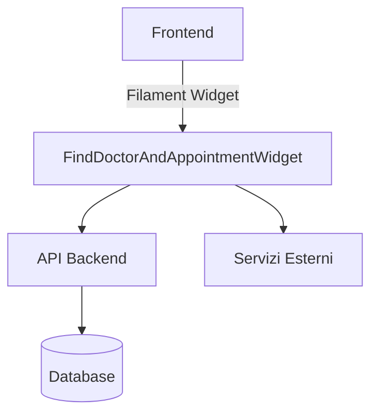

# Implementazione Trova Dentista - Dettagli Tecnici

## Indice
1. [Architettura della Soluzione](#architettura-della-soluzione)
2. [Struttura del Database](#struttura-del-database)
3. [Widget FindDoctorAndAppointment](#widget-finddoctorandappointment)
4. [API Endpoints](#api-endpoints)
5. [Considerazioni sul Design](#considerazioni-sul-design)
6. [Percorsi Alternativi](#percorsi-alternativi)

## Architettura della Soluzione

### Diagramma dei Componenti


## Struttura del Database

### Single Table Inheritance con Parental

Il sistema utilizza il pattern Single Table Inheritance (STI) tramite il pacchetto `tighten/parental` per gestire la relazione tra `User`, `Doctor` e `Dentist`.

#### users
```php
Schema::create('users', function (Blueprint $table) {
    $table->id();
    $table->string('name');
    $table->string('email')->unique();
    $table->string('password');
    $table->string('type')->default('user');
    $table->string('first_name')->nullable();
    $table->string('last_name')->nullable();
    $table->string('phone')->nullable();
    $table->string('address')->nullable();
    $table->string('city')->nullable();
    $table->string('registration_number')->nullable();
    $table->string('specialization')->nullable();
    $table->json('certifications')->nullable();
    $table->json('availability')->nullable();
    $table->string('status')->default('active');
    $table->rememberToken();
    $table->timestamps();
    $table->softDeletes();
});
```

### Relazioni

#### Doctor (estende User)
```php
class Doctor extends User
{
    use HasParent;
    use SoftDeletes;
    use BelongsToTenant;

    protected $fillable = [
        'tenant_id',
        // ... altri campi specifici del dottore
    ];

    protected $casts = [
        'is_active' => 'boolean',
        'working_hours' => 'array',
    ];
}
```

#### Dentist (tipo speciale di Doctor)
```php
class Dentist extends Doctor
{
    use HasParent;
    
    protected $fillable = [
        'license_number',
        'dental_specialization',
        // ... altri campi specifici del dentista
    ];

    protected $casts = [
        'is_active' => 'boolean',
    ];
}
```

#### Creazione di un nuovo dentista
```php
$dentist = Dentist::create([
    'name' => 'Mario',
    'surname' => 'Rossi',
    'email' => 'mario.rossi@example.com',
    'type' => 'dentist', // Questo è fondamentale per il funzionamento di Parental
    'specialization' => 'Ortodonzia',
    'license_number' => 'AB12345',
    // ... altri campi
]);
```

## Widget FindDoctorAndAppointment (per Dentisti)

### Descrizione Generale
La funzionalità "Trova Dentista" è implementata tramite un **Filament Widget** che estende `XotBaseWidget` e interagisce con il modello `Dentist` che a sua volta estende `Doctor`. Questo approccio sfrutta l'ereditarietà tramite il pacchetto Parental per condividere la logica comune tra dottori e dentisti, mantenendo al contempo le specificità di ciascun tipo di professionista sanitario.

### Struttura Directory
```
app/
  Filament/
    Widgets/
      Patient/
        FindDoctorAndAppointmentWidget.php
```

### Esempio di Implementazione (semplificato)
```php
namespace Modules\SaluteOra\Filament\Widgets\Patient;

use Filament\Forms\Components\DatePicker;
use Filament\Forms\Components\Fieldset;
use Filament\Forms\Components\Select;
use Filament\Forms\Components\TextInput;
use Filament\Forms\Components\Wizard;
use Filament\Forms\Form;
use Filament\Notifications\Notification;
use Modules\SaluteOra\Enums\AppointmentType;
use Modules\SaluteOra\Enums\DentistSpecialization;
use Modules\Xot\Filament\Widgets\XotBaseWidget;

class FindDoctorAndAppointmentWidget extends XotBaseWidget
{
    protected static string $view = 'saluteora::widgets.find-doctor-and-appointment';
    protected static ?int $sort = 1;
    protected int|string|array $columnSpan = 'full';

    public ?array $data = [];
    public array $availableSlots = [];
    public bool $isLoading = false;

    public function mount(): void
    {
        $this->form->fill();
    }

    public function form(Form $form): Form
    {
        return $form
            ->statePath('data')
            ->schema([
                Wizard::make([
                    $this->getSearchStep(),
                    $this->getDateTimeStep(),
                    $this->getConfirmationStep(),
                ])
                ->submitAction(view('filament.buttons.submit-button'))
            ]);
    }

    // ... (vedi codice sorgente per tutti i metodi)
}
```

### Step del Wizard
- **Ricerca Dentista**: utilizza il campo `type = 'dentist'` per filtrare solo i dentisti
- **Filtri Avanzati**: specializzazione, disponibilità, valutazioni
- **Selezione Orario**: basato sulle disponibilità del dentista
- **Selezione Data/Ora**: data, slot disponibili (caricati dinamicamente)
- **Conferma**: riepilogo dati, conferma prenotazione

### Logica Principale
- Caricamento slot disponibili in base alla data selezionata
- Validazione e gestione stato wizard
- Creazione appuntamento e invio notifica
- Reset stato dopo prenotazione

### Policy e Sicurezza
- Solo utenti autenticati con ruolo paziente possono visualizzare/prenotare
- Validazione input e gestione errori
- Audit trail tramite notifiche e logging

### Esempio di Submit
```php
public function submit(): void
{
    try {
        $data = $this->form->getState();
        $appointment = $this->createAppointment($data);
        $this->sendConfirmation($appointment);
        Notification::make()
            ->title(__('saluteora::app.appointment_booked_successfully'))
            ->success()
            ->send();
        $this->form->fill();
        $this->availableSlots = [];
    } catch (\Exception $e) {
        Notification::make()
            ->title(__('saluteora::app.error_booking_appointment'))
            ->body($e->getMessage())
            ->danger()
            ->send();
    }
}
```

## API Endpoints

### Ricerca Dentisti
```
GET /api/dentists/search
```

**Risposta**:
```json
{
    "data": [
        {
            "id": 1,
            "name": "Dr. Mario Rossi",
            "specialization": "Ortodonzia",
            "clinic": {
                "name": "Studio Dentistico Rossi",
                "address": "Via Roma 123, Milano"
            },
            "rating": 4.8
        }
    ]
}
```

## Considerazioni sul Design
### Gerarchia dei Modelli
- **User**: Classe base con campi comuni
- **Doctor**: Estende User, aggiunge campi specifici per i medici
- **Dentist**: Estende Doctor, aggiunge campi specifici per i dentisti

### Traduzioni
Tutti i testi devono utilizzare il sistema di traduzione Laravel, con le chiavi organizzate in:
```
resources/lang/it/doctor.php
resources/lang/it/dentist.php
```

### Performance
- Utilizzo di indici per i campi ricercati frequentemente
- Caricamento lazy delle relazioni
- Cache per i dati non frequenti

### Accessibilità
- Supporto completo per screen reader
- Tasti di scelta rapida per la navigazione
- Contrasto cromatico conforme alle linee guida WCAG, specialmente per la gestione degli appuntamenti
- Il widget deve essere responsive e accessibile

## Percorsi Alternativi

### Perché non un Form Wizard Widget Livewire?
- In passato si valutava l'uso di componenti Livewire standalone, ma la soluzione scelta è **Filament Widget** con wizard integrato, che garantisce:
    - Coerenza architetturale con il resto della piattaforma
    - Policy multi-tenant e sicurezza centralizzate
    - Maggiore manutenibilità e testabilità
    - Integrazione nativa con il sistema di notifiche e validazione Filament

---

**Aggiornare questa documentazione ad ogni evoluzione della feature e allinearla sempre al codice reale.**
