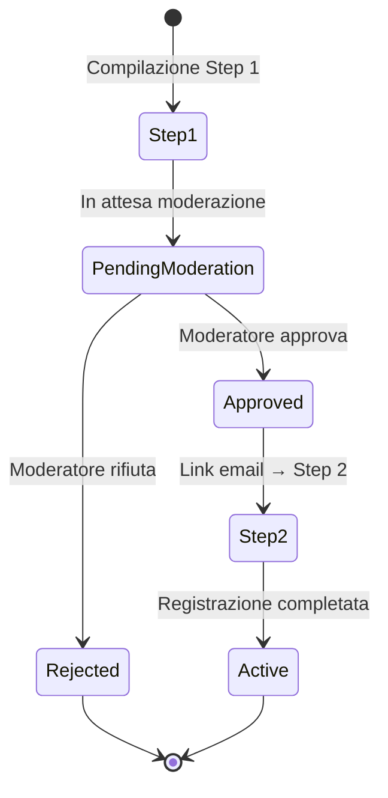

# Flusso di Moderazione nel Wizard di DoctorResource

## Contesto
Il processo di registrazione dei medici sul portale Salute Orale prevede una moderazione manuale dei dati inseriti nel primo step del Wizard. Solo dopo l'approvazione da parte di un moderatore, il medico può proseguire con la compilazione degli step successivi del wizard.

## Descrizione del Flusso

1. **Compilazione Step 1**
    - Il medico compila il primo step del Wizard inserendo i dati richiesti (es. `full_name`, certificazione).
    - Al termine, i dati vengono salvati in stato "in attesa di moderazione".
    - Il wizard si blocca e mostra un messaggio che informa l'utente che i dati sono in fase di verifica.

2. **Moderazione**
    - Un moderatore riceve una notifica (es. email o dashboard) che segnala la presenza di una nuova richiesta di registrazione.
    - Il moderatore controlla i dati inseriti dal medico.
    - Se i dati sono corretti, il moderatore approva la richiesta e cambia lo stato dell'utente a "approvato".
    - In caso di dati non validi, il moderatore può rifiutare la richiesta o richiedere integrazioni.

3. **Notifica e Ripresa Wizard**
    - Quando la richiesta viene approvata, il sistema invia una email al medico contenente un link dedicato.
    - Cliccando sul link, il medico viene reindirizzato al portale e può riprendere la compilazione del wizard dallo step 2.
    - Il wizard verifica lo stato dell'utente: se è "approvato", mostra direttamente lo step 2; se non è ancora approvato, mostra il messaggio di attesa moderazione.

### 4. Ripresa e Compilazione Step 2
Una volta che il medico accede tramite il link fornito nell'email:

1. Il sistema recupera il **token di registrazione** e verifica:
    - Validità (non scaduto, non già usato)
    - Corrispondenza con l'ID del medico
    - Stato del medico `approved`
2. Se tutti i controlli passano, il wizard:
    - Salta automaticamente lo **Step 1** (già completato)
    - Carica lo **Step 2** (es. dati di contatto, recapiti, preferenze di notifica)
    - Mostra nella UI un banner di conferma che informa l'utente che i dati dello Step 1 sono stati approvati.
3. Se i controlli falliscono (token invalido, scaduto o stato diverso da `approved`):
    - Viene mostrata una pagina di errore con istruzioni per contattare il supporto.

### 5. Completamento Registrazione
Al termine dello **Step 2** (e degli eventuali step successivi):
- Lo stato del medico diventa `active`.
- Viene inviata un'ulteriore email di benvenuto con i dettagli di accesso.
- Eventuali webhook/integrazioni di terze parti possono essere triggerate (es. CRM, analytics).

## Specifiche Email & Token

| Parametro | Valore | Note |
|-----------|--------|------|
| Oggetto Email | `Registrazione approvata – completa i tuoi dati` | Localizzata tramite LangServiceProvider |
| Contenuto | Messaggio con link unico per completare la registrazione | Template in `resources/views/emails/doctor-approved.blade.php` |
| Token | UUIDv7 crittografato | Salvato in `registration_token` |
| Scadenza Token | 7 giorni | Configurabile in `.env` |
| Rotta Link | `/doctor/registration/{token}` | Protetta da middleware `signed` |

## Stato del Flusso



## Linee Guida per gli Sviluppatori

1. **Separazione logica**: mantenere la logica di moderazione in un *Action* dedicato (`DoctorModerationAction`).
2. **Eventi e Listener**: usare eventi (`DoctorApproved`) per inviare email e generare token.
3. **Sicurezza**: il link deve usare il middleware `signed` e HTTPS obbligatorio.
4. **UX**: tutti i messaggi devono essere localizzati (`LangServiceProvider`) e privi di hard‐coded `->label()`.
5. **Test**: scrivere test end‐to‐end che coprano l’intero flusso (Step 1 → Moderazione → Email → Step 2).

---

## Documentazione tecnica e pseudo-codice

### 1. Gestione stato con Spatie Model States

Si consiglia di utilizzare [spatie/laravel-model-states](https://spatie.be/docs/laravel-model-states/v2/01-introduction) per la gestione dello stato del workflow.

**Esempio di configurazione:**
```php
// Modules/Patient/Models/DoctorRegistrationWorkflow.php
use Spatie\ModelStates\HasStates;

class DoctorRegistrationWorkflow extends Model {
    use HasStates;

    protected $casts = [
        'status' => DoctorRegistrationStatus::class,
    ];
}

// Modules/Patient/States/DoctorRegistrationStatus.php
use Spatie\ModelStates\State;
use Spatie\ModelStates\StateConfig;

abstract class DoctorRegistrationStatus extends State {
    public static function config(): StateConfig {
        return parent::config()
            ->default(Pending::class)
            ->allowTransition(Pending::class, Approved::class)
            ->allowTransition(Pending::class, Rejected::class)
            ->allowTransition(Approved::class, Active::class);
    }
}

class Pending extends DoctorRegistrationStatus {}
class Approved extends DoctorRegistrationStatus {}
class Active extends DoctorRegistrationStatus {}
class Rejected extends DoctorRegistrationStatus {}
```

**Transizione di stato:**
```php
$workflow->status->transitionTo(Approved::class);
```

- Le transizioni sono dichiarate nella config dello stato.
- Ogni stato può avere metodi specifici (es. notifiche, controlli).

**Best practice:**
- Usare sempre le transizioni dichiarate, evitare update diretti del campo status.
- Gestire logica e side-effect (notifiche, eventi) nei metodi di stato o tramite observer/eventi.
- Documentare le regole di transizione nello stato e nella doc tecnica.

Per approfondimenti:
- [Spatie Model States - Introduction](https://spatie.be/docs/laravel-model-states/v2/01-introduction)
- [Configuring states](https://spatie.be/docs/laravel-model-states/v2/working-with-states/01-configuring-states)
- [Configuring transitions](https://spatie.be/docs/laravel-model-states/v2/working-with-transitions/01-configuring-transitions)

### 2. Action di moderazione (queueable)

Si utilizza una Action dedicata seguendo lo standard [spatie/laravel-queueable-action](https://github.com/spatie/laravel-queueable-action):

```php
// Modules/Patient/Actions/DoctorModerationAction.php
use Spatie\QueueableAction\QueueableAction;

class DoctorModerationAction
{
    use QueueableAction;

    public function execute(Doctor $doctor, bool $approve, ?string $reason = null): void
    {
        // ...logica di moderazione
    }
}
```

- Centralizza logica di stato, invio email e token.

### 3. Evento e listener per approvazione

```php
// Modules/Patient/Events/DoctorApproved.php
class DoctorApproved
{
    public function __construct(public Doctor $doctor) {}
}

// Modules/Patient/Listeners/SendDoctorApprovedEmail.php
class SendDoctorApprovedEmail
{
    public function handle(DoctorApproved $event): void { /* ... */ }
}
```

### 4. Controller per la ripresa wizard

```php
// Modules/Patient/Http/Controllers/DoctorRegistrationController.php
class DoctorRegistrationController extends Controller
{
    public function resume(string $token): Response { /* ... */ }
}
```
- Verifica token, stato, validità e reindirizza allo step corretto.

### 5. Middleware per link firmato

```php
// App/Http/Middleware/EnsureLinkIsSigned.php
class EnsureLinkIsSigned
{
    public function handle($request, Closure $next) { /* ... */ }
}
```

### 6. Blade/email template

```
resources/views/emails/doctor-approved.blade.php
```
- Usa solo variabili localizzate, nessun testo hard-coded.

### 7. Test end-to-end

```php
// Modules/Patient/Tests/Feature/DoctorRegistrationTest.php
it('un medico può riprendere il wizard dopo approvazione', function () {
    // Arrange: crea medico, invia step 1, modera, invia email
    // Act: simula click link email
    // Assert: wizard parte da step 2
});
```

### 8. Best practice di clean code
- Ogni step del wizard ha un proprio metodo statico (vedi convenzioni).
- Mai usare ->label() nei form: tutte le label sono nei file di traduzione.
- Nessun campo "name" generico: solo "full_name" se richiesto dal design.
- Tutti i messaggi e le notifiche sono localizzati.
- Usare Enum per lo stato.

---

## Collegamenti e Fonti Aggiornati
- Documento di design: `/var/www/html/[progetto]/docs/12.10, Presentazione del portale.md`
- Workflow completo: [`doctor-registration-workflow.md`](./doctor-registration-workflow.md)
- Best practices Wizard: [`filament-wizard-best-practices.md`](./filament-wizard-best-practices.md)
- Regole status Enum: vedere modulo `Xot` Value Objects → `DoctorStatus.php`

## Requisiti Tecnici e UX
- Lo stato dell'utente deve essere gestito tramite un campo dedicato (es. `status` con valori: pending, approved, rejected).
- Il wizard deve essere in grado di riprendere dal punto corretto in base allo stato.
- Tutte le notifiche e i messaggi devono essere localizzati e chiari per l'utente.
- Il link di ripresa wizard deve essere sicuro e valido solo per l'utente destinatario.

## Motivazioni
- Garantire la qualità e la veridicità dei dati inseriti dai medici.
- Migliorare la sicurezza e la compliance del portale.
- Offrire una UX trasparente e guidata, evitando che l'utente possa proseguire senza validazione.

---

**Questa procedura è vincolante per il flusso di registrazione dei medici tramite Wizard.**
