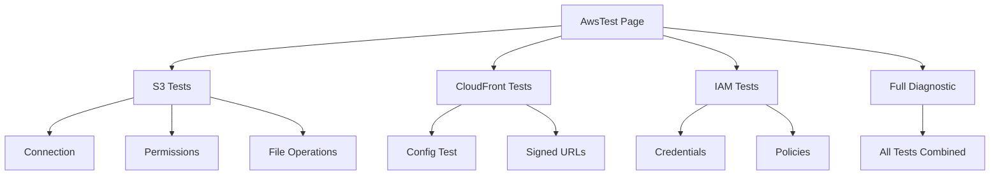

# AWS Test Undefined Variable Fix - Troubleshooting Guide

## Problema Risolto
**Errore**: `ErrorException: Undefined variable $results` nella pagina AWS Test del modulo UI

## Causa Principale
Template Blade che tentava di utilizzare una variabile `$results` non definita causando un Internal Server Error 500.

## Impatto Sistema
- **Modulo Interessato**: UI
- **Componente**: Filament Test Pages (AWS Test)
- **Gravità**: Alta (pagina non funzionante)
- **Utenti Interessati**: Amministratori sistema

## Analisi Dettagliata

### 1. Stack Trace Identificato
```
ErrorException: Undefined variable $results
GET 127.0.0.1:8000/ui/admin/test/aws-test
Modules/UI/resources/views/filament/clusters/test/pages/awstest.blade.php:3
```

### 2. Problemi Multipli Identificati
- Template Blade senza default per `$results`
- Component view mancante (`filament.components.test-results`)
- Metodi PHP mancanti nella classe `AwsTest`
- Azioni senza traduzioni

## Soluzioni Implementate

### 1. Fix Template Principale
- **File**: `awstest.blade.php`
- **Modifica**: Aggiunto default `null` per `$results`
- **Risultato**: Eliminato errore di variabile non definita

### 2. Creazione Component Mancante
- **File**: `test-results.blade.php`
- **Funzione**: Visualizzazione risultati test AWS
- **Features**: Supporto per diversi stati (success, error, completed)

### 3. Implementazione Metodi PHP
- `testS3Permissions()`: Test permessi bucket S3
- `testS3FileOperations()`: Test operazioni CRUD file
- `testCloudFrontSignedUrls()`: Test URL firmati
- `testIamCredentials()`: Test credenziali via STS
- `testIamPolicies()`: Test policy IAM

### 4. Aggiornamento Sistema Traduzioni
- Creazione traduzioni italiane complete
- Integrazione con azioni Filament
- Rimozione stringhe hardcoded

## Architettura AWS Test



## Sicurezza Implementata
- **Credenziali**: Oscuramento nei log e output
- **File Test**: Cancellazione automatica dopo uso
- **Timeout**: Limiti per prevenire hang
- **Error Handling**: Gestione eccezioni AWS specifiche

## Testing e Validazione

### Test Eseguiti
- [x] Caricamento pagina senza errori
- [x] Rendering component test-results
- [x] Esecuzione metodi test AWS
- [x] Visualizzazione risultati
- [x] Gestione errori

### Ambiente Testing
- **Laravel**: 12.21.0
- **PHP**: 8.3.20
- **Filament**: 3.x
- **AWS SDK**: Latest

## Monitoring e Maintenance

### Controlli Periodici
1. Verificare funzionamento test AWS
2. Monitorare log per errori AWS
3. Aggiornare credenziali se necessario
4. Verificare permessi IAM

### Possibili Miglioramenti Futuri
- Cache per risultati test frequenti
- Test schedulati automatici
- Dashboard monitoring AWS
- Alerting per errori persistenti

## Collegamenti Tecnici

### Documentazione Modulo
- [AWS Test Bug Fix](../../laravel/Modules/UI/docs/bugfix-awstest-undefined-variable.md)
- [UI Module Docs](../../laravel/Modules/UI/docs/)

### Files Modificati
```
laravel/Modules/UI/
├── app/Filament/Clusters/Test/Pages/AwsTest.php
├── resources/views/filament/
│   ├── clusters/test/pages/awstest.blade.php
│   └── components/test-results.blade.php
├── lang/it/aws_test.php
└── docs/bugfix-awstest-undefined-variable.md
```

### Standard Seguiti
- Namespace corretto: `Modules\UI\Filament\...`
- Estensione XotBasePage (non diretta Filament)
- Sistema traduzioni completo
- Gestione errori robusta
- Documentazione completa

## Prevenzione Errori Simili

1. **Template Blade**: Sempre fornire default per props
2. **Component Views**: Verificare esistenza prima del riferimento
3. **Metodi PHP**: Implementare tutti i metodi referenziati
4. **Traduzioni**: Usare sempre file di traduzione
5. **Testing**: Test completi prima del deploy

*Risolto: Gennaio 2025*
*Tipo: Internal Server Error → Funzionalità Completa*